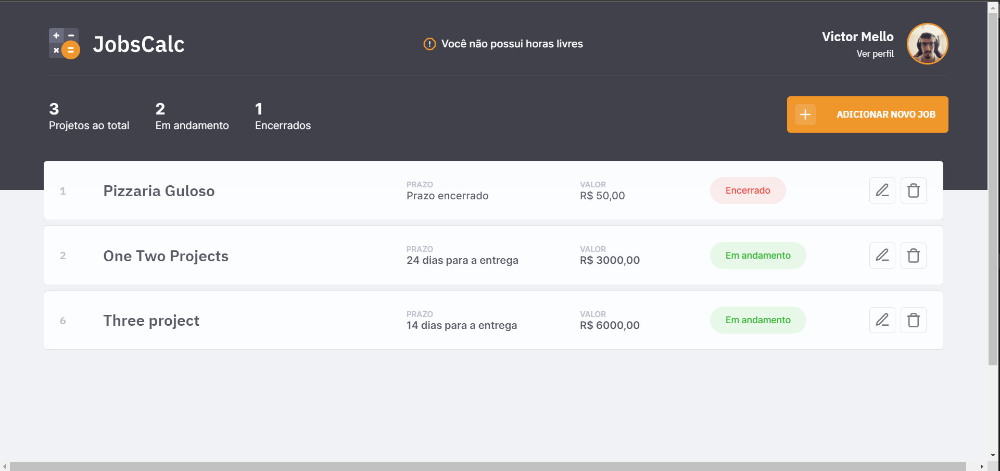

## Projeto Maratona Discover - 2ª Edição



<p align="center">
  
  
  <a href="https://github.com/VictorMello1993/FlappyBird/commits/master">
    
  </a> 
  
  
   <a href="https://github.com/VictorMello1993/MaratonaDiscovery2/stargazers"></a>
</p>

<p align="center">
  <a href="#earth_americas-visão-geral">Visão geral</a> •
  <a href="#wrench-recursos">Recursos</a> •
  <a href="#triangular_flag_on_postcomeçando">Começando</a> •
  <a href="#melhorias-a-implementar">Melhorias a implementar</a> •  
</p>

<h2>:earth_americas: Visão geral</h2>
<p>Apllicação construída com intuito de revisar os conceitos de back-end com Node.js abordados na Maratona Discover 2ª edição, promovida pela<a href="https://rocketseat.com.br/">Rocketseat</a>. Trata-se de uma aplicação de gerenciamento de projetos freelancer, que calcula qual o valor que a pessoa irá ganhar proporcional ao número de horas estimadas do projeto e ao número de horas que a pessoa irá se dedicar diariamente num projeto.</p>

---

<h2>:wrench: Recursos</h2>
<ul>
  <li>HTML</li>
  <li>CSS</li>
  <li>JavaScript</li>
  <li>Node.js</li>
  <li>SQLite</li>
  <li>EJS (Template Engine do HTML)</li>
</ul>

---

<h2>:triangular_flag_on_post:Começando</h2>

1 - Clone o repositório
```
git clone https://github.com/VictorMello1993/MaratonaDiscover2.git
```
2 - Abra VS Code e abra a pasta "MaratonaDiscover2" que é a pasta raíz do projeto

3 - No terminal do VS Code, digite `npm i` para instalar todas as dependências ao projeto

4 - Ainda no terminal, digite `npm run dev` para iniciar o servidor. Caso ocorra algum erro, provavelmente é a porta já ocupada por outra aplicação. Então, mude de porta na linha ```server.listen(3001, () => console.log('Loading...'))``` no ```server.js```, trocando 3001 para qualquer outra porta, e execute novamente o comando

5 - Se estiver funcionando na porta 3001, na barra de endereços do seu navegador, escreva `localhost: 3001` que a aplicação já está em execução

---


